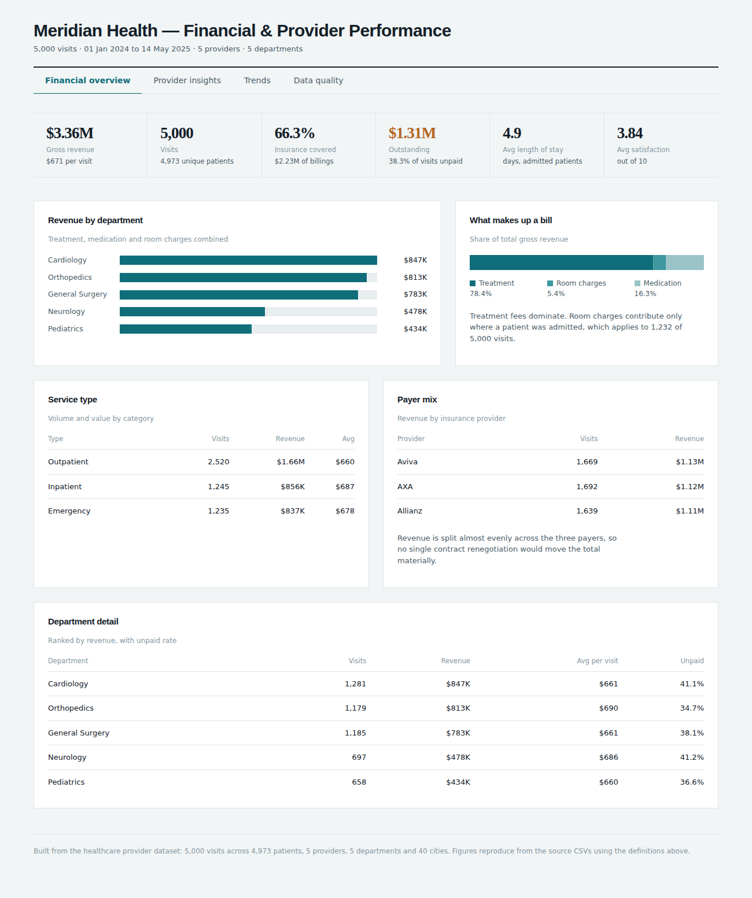
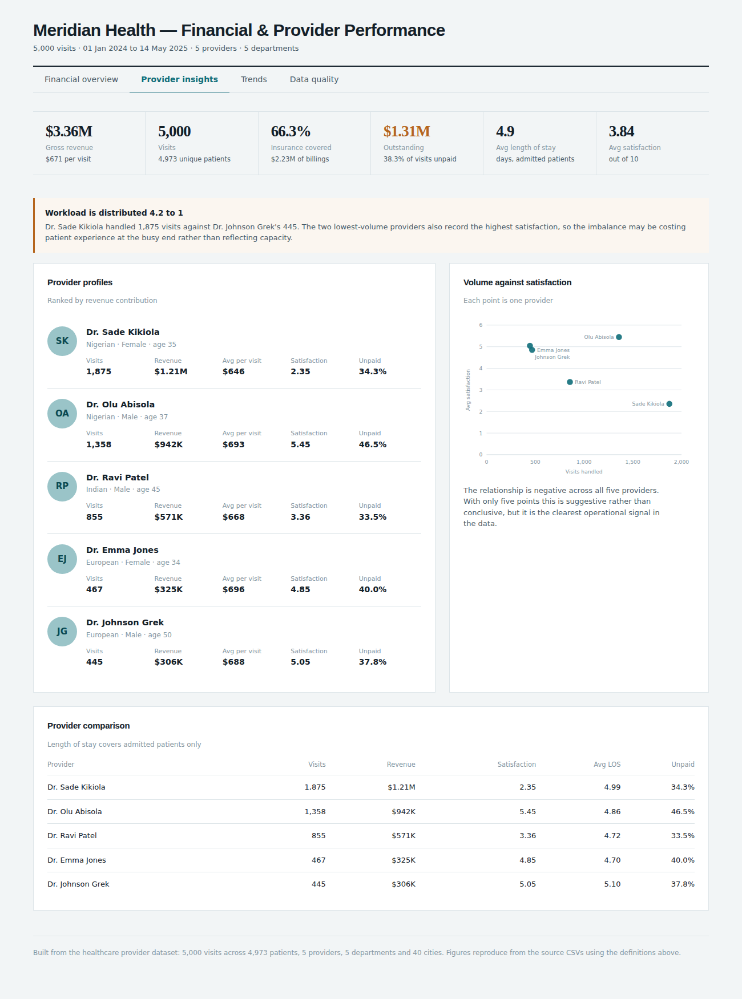
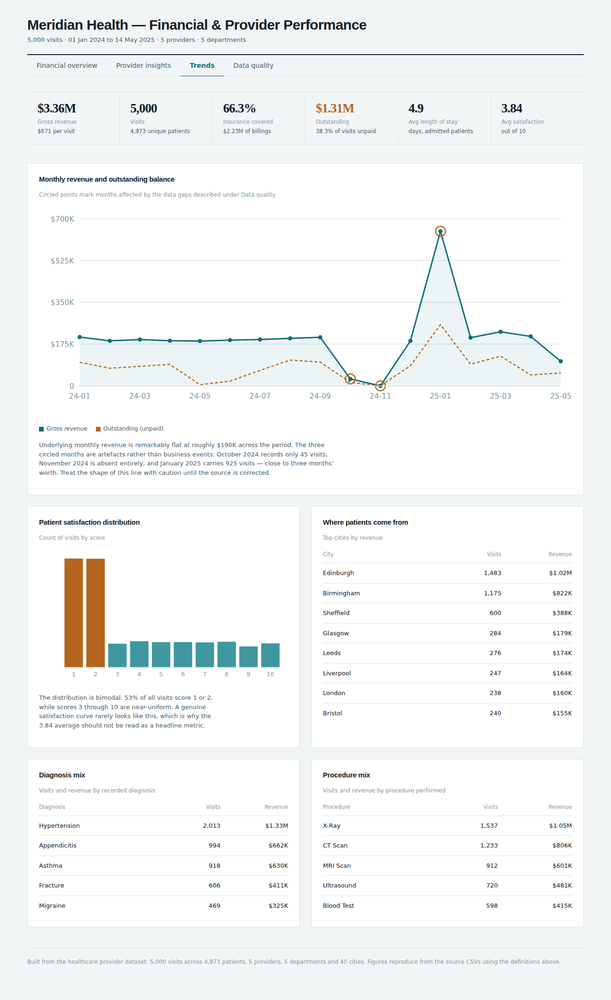
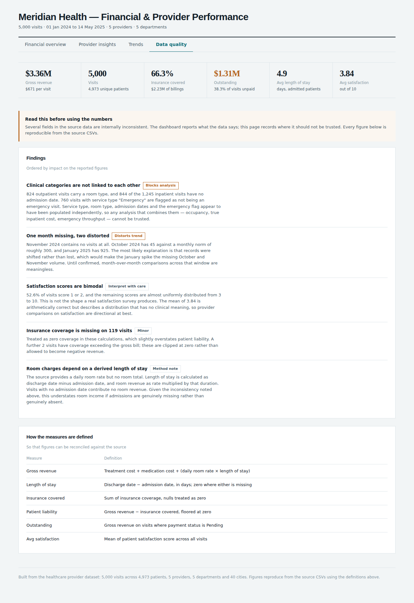

# Healthcare Provider Analytics

Financial and provider performance analysis of a healthcare centre, delivered as a four-page interactive dashboard built from raw CSV extracts.



**[View the live dashboard →](https://idowumayowa.github.io/healthcare-analytics/)**

## Purpose
The brief asked for an analysis of a healthcare centre's financial performance and its providers, presented as a 3–4 page interactive dashboard.

The source data arrives as eight CSVs in a star layout — a visits fact table joined to seven dimensions — but with no revenue column. Gross revenue, length of stay, patient liability, and outstanding balance all have to be derived before any financial question can be answered.

The analysis surfaced a second, less comfortable finding: several fields in the source contradict each other. Rather than build charts on top of that quietly, the dashboard reports the figures and dedicates a page to documenting exactly where they should not be trusted.

## Key Findings

**38.3% of revenue is unpaid.** $1.31M of $3.36M gross revenue sits in Pending status. This is the largest single financial issue in the data and it is consistent across departments, ranging only from 34.7% (Orthopedics) to 41.2% (Neurology) — suggesting a systemic collections problem rather than a departmental one.

**Provider workload is distributed 4.2 to 1.** Dr. Sade Kikiola handled 1,875 visits; Dr. Johnson Grek handled 445. Revenue per visit is nearly identical across all five providers ($646–$696), so the imbalance is volume, not case mix.

**Satisfaction falls as volume rises.** The two lowest-volume providers record the highest satisfaction (5.45 and 5.05); the highest-volume provider records the lowest (2.35). With five providers this is suggestive rather than conclusive, but it is the clearest operational signal available and it points at the workload imbalance above.

**Revenue is genuinely flat.** Excluding data artefacts, monthly revenue holds at roughly $190K with no growth or seasonality across seventeen months.

**Payer concentration is not a risk.** Aviva, AXA and Allianz each account for close to a third of revenue, so no single contract renegotiation would move the total materially.

## Dashboard

Four pages, built as a single self-contained HTML file with no dependencies beyond a web font.

| Page | Contents |
| --- | --- |
| **Financial overview** | Revenue by department, bill composition, service type and payer mix, department detail with unpaid rates |
| **Provider insights** | Provider profiles with volume, revenue and satisfaction; volume-against-satisfaction scatter; full comparison table |
| **Trends** | Monthly revenue against outstanding balance, satisfaction distribution, geographic mix, diagnosis and procedure breakdowns |
| **Data quality** | Documented inconsistencies, their impact, and the definition of every measure |

<table>
<tr>
<td width="50%"></td>
<td width="50%"></td>
</tr>
</table>

## Data Model

The source is already a star schema: `visits` as the fact table at one row per visit, joined to seven dimensions.


No revenue column exists in the source. The financial measures are derived:

| Measure | Definition |
| --- | --- |
| Length of stay | `discharge_date − admitted_date`, in days; zero where either is missing |
| Room revenue | `room_charges_daily × length_of_stay` |
| Gross revenue | `treatment_cost + medication_cost + room_revenue` |
| Patient liability | `gross_revenue − insurance_coverage`, floored at zero |
| Outstanding | `gross_revenue` where `payment_status = 'Pending'` |

## Data Quality

Five issues were found. They are reported rather than silently corrected, because the right fix depends on which field is authoritative — a question for the data owner.

**Clinical categories are not linked to each other.** 824 outpatient visits carry a room type. 844 of 1,245 inpatient visits have no admission date. 760 visits with service type "Emergency" are flagged as not being an emergency visit. Service type, room type, admission dates and the emergency flag appear to have been populated independently, so any analysis combining them — occupancy, true inpatient cost, emergency throughput — cannot be trusted.

**One month missing, two distorted.** November 2024 contains no visits. October 2024 has 45 against a monthly norm near 300, and January 2025 has 925. The likely explanation is that records were shifted rather than lost, which would make the January spike the missing October and November volume.

**Satisfaction scores are bimodal.** 52.6% of visits score 1 or 2; scores 3 through 10 are near-uniform. This is not the shape a real satisfaction survey produces, so the 3.84 average is arithmetically correct but not clinically meaningful.

**Insurance coverage missing on 119 visits**, treated as zero, which slightly overstates patient liability. Two visits have coverage exceeding the gross bill and are clipped at zero.

**Room revenue depends on derived length of stay**, so it understates income if admission dates are missing rather than genuinely absent.



## Implementation

`analysis.py` reads the eight CSVs, derives the measures, computes every aggregate the dashboard needs, and writes a single JSON.

The monthly series is reindexed against a complete period range so a missing month renders as a gap rather than silently closing up:

```python
months = pd.period_range(v["month"].min(), v["month"].max(), freq="M")

m = (v.groupby("month")
       .apply(lambda g: pd.Series({
           "visits": len(g),
           "revenue": g.gross_revenue.sum(),
           "outstanding": g.loc[g.is_pending, "gross_revenue"].sum(),
       }), include_groups=False)
       .reindex(months, fill_value=0)
       .reset_index(names="month"))
```

Without the reindex, November 2024 would disappear from the chart entirely and the line would connect October to December, hiding the anomaly rather than exposing it.

The quality checks are code, not commentary, so they re-run against any refreshed extract:

```python
def data_quality_checks(v, months):
    return {
        "room_on_outpatient": int(((v["Service Type"] == "Outpatient")
                                   & v["Room Type"].notna()).sum()),
        "inpatient_no_admit": int(((v["Service Type"] == "Inpatient")
                                   & v["admitted"].isna()).sum()),
        "emergency_flag_mismatch": int(((v["Service Type"] == "Emergency")
                                        & (v["Emergency Visit"] == "No")).sum()),
        "missing_months": [str(m) for m in months if m not in v["month"].unique()],
        ...
    }
```

The dashboard is hand-built HTML with SVG charts rather than a charting library, which keeps the visual language consistent across every chart and the whole deliverable to a single file that opens in any browser.

## Repository Structure
```
healthcare-analytics/
├── data/
│   ├── visits.csv                 # 5,000 rows — fact table
│   ├── patients.csv               # 4,973 rows
│   ├── providers.csv              # 5 rows
│   ├── departments.csv
│   ├── diagnoses.csv
│   ├── procedures.csv
│   ├── insurance.csv
│   └── cities.csv                 # 40 rows
├── docs/
│   ├── images/
│   └── index.html                 # Published dashboard
├── analysis.py                    # Builds data.json from the CSVs
├── data-model.dbml                # Star schema definition
├── dashboard.html
└── README.md
```

## Running It

```bash
pip install pandas
python analysis.py --data-dir data --out data.json
```

Then open `dashboard.html` in a browser. The dashboard reads its figures from an embedded copy of the JSON, so it works offline and needs no server.

```
Wrote data.json
  5,000 visits · $3,356,075 gross revenue
  38.3% unpaid · 66.3% insurance covered
  1 missing month(s) detected
```

## Design Notes
- **Derived measures documented in the interface.** Every figure's definition appears on the data quality page, so a stakeholder can reconcile any number against the source without reading code.
- **Anomalies marked on the chart, not smoothed away.** The three affected months are circled on the revenue line rather than excluded, because hiding them would make a broken series look like a business trend.
- **Quality checks as code.** Written as functions that re-run on any refreshed extract, rather than as findings noted once and forgotten.
- **Single-file deliverable.** No build step, no server, no dependencies at view time — it opens from disk, which matters when the audience is a finance stakeholder rather than a developer.

## Limitations
- The inconsistencies between service type, room type and admission dates mean occupancy and true inpatient profitability cannot be calculated from this extract.
- Five providers is too small a sample to test the volume-satisfaction relationship statistically; it is reported as an observation, not a finding.
- No cost data exists, so all figures are revenue rather than margin. Provider "performance" here measures throughput and revenue contribution, not profitability or clinical outcome.
